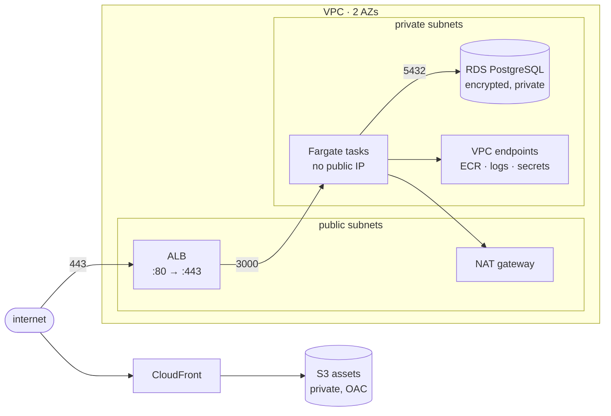

# terraform-node-aws

[](https://github.com/mohadjillani/terraform-node-aws/actions/workflows/ci.yml)
[](LICENSE)

The AWS a Node service actually runs on: a VPC across two availability zones,
ECS Fargate behind an ALB, RDS PostgreSQL, S3 and CloudFront for assets, secrets
in Secrets Manager, and CI that plans on a pull request and applies the plan
that was reviewed.

Four modules, composed by environment files that contain nothing but sizing.

**It has never been applied.** There is no AWS account behind this repository —
see [what is verified](#what-is-verified-and-what-is-not), which is the section
that matters most.

## What it provisions



## The 38 assertions

There is no account to plan against, so the security rules are executable
policy rather than prose. `terraform test` with mocked providers evaluates the
real configuration and asserts:

```hcl
run "the_role_can_read_one_secret_and_no_others" {
  assert {
    condition     = !can(regex("\"Resource\":\\s*\"\\*\"", local.execution_extra_policy))
    error_message = "A policy statement grants access to every resource."
  }
}
```

| what is asserted | where |
| --- | --- |
| no security group is open to `0.0.0.0/0` except the ALB on 80 and 443 | service, network |
| private subnets have no route to the internet gateway | network |
| tasks run in private subnets with no public address | service |
| the task role names one secret ARN, never `*` | service |
| RDS is encrypted, private, and cannot skip its final snapshot | data |
| backup retention of zero is refused by the module | data |
| the assets bucket blocks public access four ways | cdn |
| only this CloudFront distribution can read the bucket | cdn |
| only this repository can assume the CI role | bootstrap |
| dev runs one NAT gateway, prod one per AZ | network, environments |

They run in about twenty seconds on every push, with no credentials and no
cost. [ADR 4](docs/adr/0004-verified-by-terraform-test.md) covers what that can
and cannot prove.

## Cost, generated rather than typed

From [docs/cost.md](docs/cost.md), computed from the sizing in
`environments/*/main.tf` and a committed price snapshot — so the table cannot
quietly disagree with the configuration, and CI fails if it does.

| line | dev | prod |
| --- | ---: | ---: |
| ECS Fargate | $10.36 | $124.35 |
| NAT gateway | $37.44 | $72.48 |
| VPC interface endpoints | $0.00 | $64.24 |
| Application Load Balancer | $30.08 | $30.08 |
| RDS PostgreSQL | $15.88 | $320.86 |
| CloudWatch Logs | $6.30 | $6.30 |
| Secrets Manager | $0.40 | $0.40 |
| S3 + CloudFront | $8.62 | $11.52 |
| **Total** | **$109.08** | **$630.22** |

**Generating this changed a decision.** VPC interface endpoints take image pulls
and log shipping off the NAT gateway's per-gigabyte charge — and they are billed
per endpoint per availability zone, which for four endpoints across two AZs is
eight hourly charges. The first table showed them costing **$64/month in dev**,
more than the NAT egress they were saving, and more than any other dev line.

So dev turns them off and prod leaves them on. Dev went from $173 to $109, a
37% saving, from a number that only existed because the table is generated. A
list-price estimate, not a bill — the assumptions are in the file.

## Layout

```text
modules/network   VPC, subnets, NAT, routes, VPC endpoints
modules/service   ECS cluster, task, service, ALB, IAM, autoscaling
modules/data      RDS, subnet group, parameter group, the secret
modules/cdn       S3 with OAC, CloudFront, lifecycle
environments/dev  composition + sizing only
environments/prod composition + sizing only
bootstrap/        run once by hand: state bucket, lock table, OIDC role
tests/            38 policy assertions
```

The environment files contain no resources. If it is not a size, a count, or a
protection toggle, it belongs in a module — which is what keeps the diff between
dev and prod readable in one screen.
[ADR 1](docs/adr/0001-modules-and-thin-environments.md)

## Two decisions worth copying

**Apply the plan that was reviewed.** The usual pipeline plans on a pull request
and applies on merge — two different plans, with anything at all able to change
between them. Here the plan job writes `-out=tfplan` and uploads it; the apply
job applies *that file*. If the world moved, Terraform refuses the stale plan
rather than applying something nobody approved.
[ADR 2](docs/adr/0002-apply-the-reviewed-plan.md)

**OIDC, and the `sub` condition.** No long-lived AWS keys exist anywhere. The
trust policy pins the repository:

```
"token.actions.githubusercontent.com:sub" = "repo:mohadjillani/terraform-node-aws:*"
```

Without that line the policy says "any token from GitHub Actions" — meaning any
workflow in any repository on earth can assume the role. It is the most common
OIDC misconfiguration and it is invisible until someone finds it. There is a
test for it. [ADR 3](docs/adr/0003-oidc-not-access-keys.md)

## Running it

```bash
terraform init -backend=false
terraform test              # 38 assertions, no AWS account needed
terraform fmt -check -recursive
npm run cost                # regenerates docs/cost.md
```

Pointing it at a real account: run `bootstrap/` once by hand, uncomment the
backend block in each environment, set `AWS_ROLE_ARN` as a repository variable,
and merge. [docs/runbook.md](docs/runbook.md) covers deploying, rolling back,
a half-finished apply, a stuck state lock, and restoring the database.

## What is verified, and what is not

**Verified on every push:** `terraform fmt`, `validate` on every module and
environment, `tflint` with the AWS ruleset, 38 `terraform test` assertions
against mocked providers, and a check that the cost table still matches the
environment files.

**Never run:** `terraform apply`. Not once, in any account. `deploy.yml` is
written and wired and is skipped entirely without an `AWS_ROLE_ARN`.

That leaves real gaps, and they are worth naming rather than glossing:

- whether AWS accepts this configuration — quotas, IAM policy simulation, ACM
  DNS validation, whether the ECS task actually starts
- whether the container health check command works against a real image
- anything about behaviour under load, failover, or a real AZ outage

The mocked plan is a genuine check of the configuration, the module wiring and
the defaults. It is not a substitute for having run the thing, and this README
does not pretend otherwise.

Two bugs it did catch, which reading would not have:

- `for_each` over security group ids from another module **cannot be planned** —
  the keys are unknown until apply, so it would have failed the first real
  apply. It is a `count` now.
- a mocked `aws_iam_policy_document` returns a fake `json`, so the
  least-privilege assertions would have been testing the mock. Policies are
  built with `jsonencode`, which Terraform evaluates itself.

## Limits

**No WAF, no GuardDuty, no CloudTrail.** This provisions infrastructure; it does
not watch it. [docs/threat-model.md](docs/threat-model.md) says what an attacker
reaches from where, and what is deliberately not addressed.

**Task egress is open.** Locking it down needs a list of every outbound
dependency, which is a project rather than a line in a module.

**No secret rotation.** The database password is created once. Rotation needs a
Lambda and an application that re-reads the secret; doing it badly locks the
service out of its own database.

**One region, no DR.** Multi-AZ is a failover; multi-region is a different
architecture and a much larger bill.

**Cost is a list-price estimate.** No Savings Plans, no Reserved Instances, no
free tier, no tax, and traffic assumptions that are guesses. AWS bills what AWS
bills.

## Decisions

- [1. Four modules, composed by environment files that hold only sizing](docs/adr/0001-modules-and-thin-environments.md)
- [2. Apply the saved plan, never a fresh one](docs/adr/0002-apply-the-reviewed-plan.md)
- [3. OIDC federation, not access keys in secrets](docs/adr/0003-oidc-not-access-keys.md)
- [4. Verify with `terraform test` and mock providers](docs/adr/0004-verified-by-terraform-test.md)

## License

MIT
